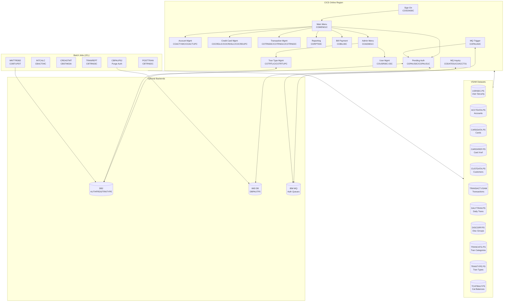
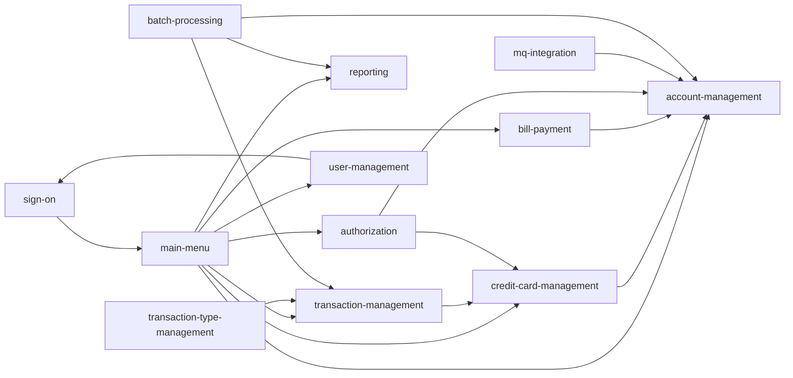

# System CardDemo - Overview for User Stories

**Version:** 2025-04-01  
**Purpose:** Single source of truth for creating well-structured User Stories

---

## 📊 Platform Statistics

- **Technology Stack:** COBOL, CICS, VSAM, JCL, Assembler; optional DB2, IMS DB, MQ
- **Architecture Pattern:** CICS Online + Batch, VSAM-backed persistence, mainframe-native
- **Key Capabilities:** Credit card lifecycle management, account/customer management, transaction processing, reporting, bill payment, user administration
- **Deployment Target:** IBM z/OS mainframe (AWS Mainframe Modernization compatible)

---

## 🏗️ High-Level Architecture

### Technology Stack
**Runtime:** IBM CICS (transaction processing)  
**Language:** COBOL (primary), Assembler (utilities)  
**Storage:** VSAM KSDS with AIX (primary), DB2 (optional), IMS DB (optional)  
**Messaging:** IBM MQ (optional)  
**Batch:** JCL with IDCAMS, SORT, custom COBOL batch programs  
**Security:** RACF (user authentication, resource protection)

### Architectural Patterns
- **CICS Pseudo-conversational:** Each screen interaction returns control to CICS between maps
- **BMS Maps:** Defined screen layouts drive all online terminal UI
- **COMMAREA passing:** State is passed between CICS programs via a COMMAREA data structure
- **VSAM KSDS:** Key-sequenced datasets for all primary entities; Alternate Indexes for cross-reference queries
- **Batch-online integration:** Batch jobs process offline; CICS OPEN/CLOSE JCL controls file availability
- **Copybook-driven data contracts:** All record structures defined in shareable COBOL copybooks

---

## 📚 Module Catalog

<!-- MODULE_LIST_START -->
**Modules:** sign-on, main-menu, account-management, credit-card-management, transaction-management, reporting, bill-payment, user-management, batch-processing, authorization, transaction-type-management, mq-integration
<!-- MODULE_LIST_END -->

---

### 1. Sign-On
**ID:** `sign-on`  
**Purpose:** Authenticate users (regular and admin) and initiate the CardDemo CICS session.  
**Key Components:**  
- `COSGN00C.cbl` — CICS sign-on program  
- `COSGN00.bms` — BMS map for sign-on screen  
- `CSUSR01Y.cpy` — User security record copybook  

**CICS Transaction:** `CC00`  
**Storage:** VSAM `AWS.M2.CARDDEMO.USRSEC.PS` (User Security file)

**User Story Examples:**
- As a **regular user**, I want to log in with my user ID and password so that I can access my account.
- As an **admin user**, I want to authenticate with admin credentials so that I can manage users and system settings.

---

### 2. Main Menu
**ID:** `main-menu`  
**Purpose:** Present a context-sensitive main menu after login, routing users to the correct function.  
**Key Components:**  
- `COMEN01C.cbl` — CICS main menu program  
- `COMEN01.bms` — BMS map for main menu  
- `COCOM01Y.cpy` — Common communication area  

**CICS Transaction:** `CM00`

**User Story Examples:**
- As a **regular user**, I want to see a menu of available functions so that I can navigate to account, card, or transaction screens.
- As an **admin user**, I want to see admin-specific options so that I can manage users and transaction types.

---

### 3. Account Management
**ID:** `account-management`  
**Purpose:** View and update credit card account information, including balances, credit limits, and dates.  
**Key Components:**  
- `COACTVWC.cbl` — Account view program  
- `COACTUPC.cbl` — Account update program  
- `COACTVW.bms`, `COACTUP.bms` — BMS maps  
- `CVACT01Y.cpy` — Account record structure (300 bytes)  

**CICS Transactions:** `CAVW` (View), `CAUP` (Update)  
**Storage:** VSAM `AWS.M2.CARDDEMO.ACCTDATA.PS`

**Data Model — ACCOUNT-RECORD:**
```
ACCT-ID                  PIC 9(11)     -- Unique account identifier
ACCT-ACTIVE-STATUS       PIC X(01)     -- Y=Active, N=Inactive
ACCT-CURR-BAL            PIC S9(10)V99 -- Current balance
ACCT-CREDIT-LIMIT        PIC S9(10)V99 -- Credit limit
ACCT-CASH-CREDIT-LIMIT   PIC S9(10)V99 -- Cash credit limit
ACCT-OPEN-DATE           PIC X(10)     -- Account open date
ACCT-EXPIRAION-DATE      PIC X(10)     -- Account expiration date
ACCT-REISSUE-DATE        PIC X(10)     -- Last reissue date
ACCT-CURR-CYC-CREDIT     PIC S9(10)V99 -- Current cycle credits
ACCT-CURR-CYC-DEBIT      PIC S9(10)V99 -- Current cycle debits
ACCT-ADDR-ZIP            PIC X(10)     -- ZIP code
ACCT-GROUP-ID            PIC X(10)     -- Group / segment identifier
```

**User Story Examples:**
- As a **regular user**, I want to view my current balance and credit limit so that I can manage my spending.
- As a **regular user**, I want to update my account's ZIP code so that my billing address is current.
- As an **admin**, I want to update credit limits on an account so that I can respond to customer requests.

---

### 4. Credit Card Management
**ID:** `credit-card-management`  
**Purpose:** List, view, and update credit cards associated with an account.  
**Key Components:**  
- `COCRDLIC.cbl` — Credit card list program  
- `COCRDSLC.cbl` — Credit card view/detail program  
- `COCRDUPC.cbl` — Credit card update program  
- `COCRDLI.bms`, `COCRDSL.bms`, `COCRDUP.bms` — BMS maps  
- `CVACT02Y.cpy` — Card record structure (150 bytes)  
- `CVACT03Y.cpy` — Card cross-reference record (50 bytes)  

**CICS Transactions:** `CCLI` (List), `CCDL` (View), `CCUP` (Update)  
**Storage:** VSAM `AWS.M2.CARDDEMO.CARDDATA.PS`, `AWS.M2.CARDDEMO.CARDXREF.PS`

**Data Model — CARD-RECORD:**
```
CARD-NUM               PIC X(16)  -- 16-digit card number
CARD-ACCT-ID           PIC 9(11)  -- Linked account ID
CARD-CVV-CD            PIC 9(03)  -- CVV security code
CARD-EMBOSSED-NAME     PIC X(50)  -- Name on card
CARD-EXPIRAION-DATE    PIC X(10)  -- Expiration date
CARD-ACTIVE-STATUS     PIC X(01)  -- Y=Active, N=Inactive
```

**Data Model — CARD-XREF-RECORD:**
```
XREF-CARD-NUM   PIC X(16)  -- Card number
XREF-CUST-ID    PIC 9(09)  -- Customer ID
XREF-ACCT-ID    PIC 9(11)  -- Account ID
```

**User Story Examples:**
- As a **regular user**, I want to list all my credit cards so that I can select one to view details.
- As a **regular user**, I want to see card status and expiration date so that I know when to request a new card.
- As an **admin**, I want to update card active status so that I can activate or deactivate a card.

---

### 5. Transaction Management
**ID:** `transaction-management`  
**Purpose:** Browse, view, and add credit card transactions.  
**Key Components:**  
- `COTRN00C.cbl` — Transaction list program  
- `COTRN01C.cbl` — Transaction view/detail program  
- `COTRN02C.cbl` — Transaction add program  
- `COTRN00.bms`, `COTRN01.bms`, `COTRN02.bms` — BMS maps  
- `CVTRA05Y.cpy` — Transaction record (KSDS, 350 bytes)  
- `CVTRA06Y.cpy` — Daily transaction record (sequential, 350 bytes)  
- `CVTRA03Y.cpy` — Transaction type (60 bytes)  
- `CVTRA04Y.cpy` — Transaction category type (60 bytes)  

**CICS Transactions:** `CT00` (List), `CT01` (View), `CT02` (Add)  
**Storage:** VSAM `AWS.M2.CARDDEMO.TRANSACT.VSAM.KSDS`, `AWS.M2.CARDDEMO.DALYTRAN.PS`

**Data Model — TRAN-RECORD:**
```
TRAN-ID              PIC X(16)     -- Unique transaction ID
TRAN-TYPE-CD         PIC X(02)     -- Transaction type code
TRAN-CAT-CD          PIC 9(04)     -- Transaction category code
TRAN-SOURCE          PIC X(10)     -- Source system
TRAN-DESC            PIC X(100)    -- Description
TRAN-AMT             PIC S9(09)V99 -- Amount
TRAN-MERCHANT-ID     PIC 9(09)     -- Merchant ID
TRAN-MERCHANT-NAME   PIC X(50)     -- Merchant name
TRAN-MERCHANT-CITY   PIC X(50)     -- Merchant city
TRAN-MERCHANT-ZIP    PIC X(10)     -- Merchant ZIP
TRAN-CARD-NUM        PIC X(16)     -- Card number used
TRAN-ORIG-TS         PIC X(26)     -- Original timestamp
TRAN-PROC-TS         PIC X(26)     -- Processing timestamp
```

**Data Model — TRAN-CAT-RECORD:**
```
TRAN-TYPE-CD        PIC X(02)  -- Transaction type code
TRAN-CAT-CD         PIC 9(04)  -- Category code
TRAN-CAT-TYPE-DESC  PIC X(50)  -- Category description
```

**User Story Examples:**
- As a **regular user**, I want to browse my transaction history so that I can review my spending.
- As a **regular user**, I want to view the details of a specific transaction so that I can verify a charge.
- As a **regular user**, I want to add a new transaction so that I can record a purchase.

---

### 6. Reporting
**ID:** `reporting`  
**Purpose:** Generate and view transaction category reports.  
**Key Components:**  
- `CORPT00C.cbl` — Online report request program (submits batch)  
- `CBTRN03C.cbl` — Batch transaction report program  
- `CORPT00.bms` — BMS map for report screen  
- `CVTRA01Y.cpy` — Transaction category balance record (50 bytes)  
- `CVTRA02Y.cpy` — Disclosure group record (50 bytes)  

**CICS Transaction:** `CR00`  
**Batch Job:** `TRANREPT`  
**Storage:** VSAM `AWS.M2.CARDDEMO.TCATBALF.PS`, `AWS.M2.CARDDEMO.DISCGRP.PS`

**User Story Examples:**
- As a **regular user**, I want to request a transaction category report so that I can see spending by category.
- As an **admin**, I want to review generated statements so that I can validate batch output.

---

### 7. Bill Payment
**ID:** `bill-payment`  
**Purpose:** Process bill payments against an account balance.  
**Key Components:**  
- `COBIL00C.cbl` — Bill payment program  
- `COBIL00.bms` — BMS map  
- `CVACT01Y.cpy` — Account record (balance update)  

**CICS Transaction:** `CB00`  
**Storage:** VSAM `AWS.M2.CARDDEMO.ACCTDATA.PS`

**User Story Examples:**
- As a **regular user**, I want to make a bill payment so that I can reduce my outstanding balance.
- As a **regular user**, I want to see my current balance before paying so that I can decide how much to pay.

---

### 8. User Management
**ID:** `user-management`  
**Purpose:** Admin functions for listing, adding, updating, and deleting application users.  
**Key Components:**  
- `COADM01C.cbl` — Admin menu program  
- `COUSR00C.cbl` — List users  
- `COUSR01C.cbl` — Add user  
- `COUSR02C.cbl` — Update user  
- `COUSR03C.cbl` — Delete user  
- `COADM01.bms`, `COUSR00.bms`, `COUSR01.bms`, `COUSR02.bms`, `COUSR03.bms` — BMS maps  
- `CSUSR01Y.cpy` — User security record (80 bytes)  

**CICS Transactions:** `CA00` (Admin Menu), `CU00` (List), `CU01` (Add), `CU02` (Update), `CU03` (Delete)  
**Storage:** VSAM `AWS.M2.CARDDEMO.USRSEC.PS`

**Data Model — SEC-USER-DATA:**
```
SEC-USR-ID      PIC X(08)  -- User ID (8 chars)
SEC-USR-FNAME   PIC X(20)  -- First name
SEC-USR-LNAME   PIC X(20)  -- Last name
SEC-USR-PWD     PIC X(08)  -- Password (8 chars)
SEC-USR-TYPE    PIC X(01)  -- U=User, A=Admin
```

**User Story Examples:**
- As an **admin**, I want to list all registered users so that I can manage access.
- As an **admin**, I want to add a new user so that they can access the system.
- As an **admin**, I want to update a user's password so that I can assist with password resets.
- As an **admin**, I want to delete a user so that I can revoke access for departed employees.

---

### 9. Batch Processing
**ID:** `batch-processing`  
**Purpose:** Daily batch cycle: transaction posting, interest calculation, statement generation, data refresh, and report production.  
**Key Components:**  
- `CBTRN01C.cbl` — Transaction validation batch  
- `CBTRN02C.cbl` — Transaction posting (POSTTRAN job)  
- `CBTRN03C.cbl` — Transaction report (TRANREPT job)  
- `CBACT01C.cbl` — Account read batch  
- `CBACT02C.cbl` — Account balance update  
- `CBACT03C.cbl` — Account interest calculation support  
- `CBACT04C.cbl` — Interest calculator (INTCALC job)  
- `CBSTM03A.CBL`, `CBSTM03B.CBL` — Statement generation (CREASTMT job)  
- `CBCUS01C.cbl` — Customer read batch  
- `CBIMPORT.cbl`, `CBEXPORT.cbl` — Import/export utilities  
- `COBSWAIT.cbl` — Batch wait utility  
- `CSUTLDTC.cbl` — Date utility  
- `COBDATFT.asm` — Date format conversion (Assembler)  
- `MVSWAIT.asm` — Timer wait (Assembler)  

**Batch Jobs (in execution order):**

| Job       | Program   | Function                                       |
|-----------|-----------|------------------------------------------------|
| CLOSEFIL  | IEFBR14   | Close VSAM files in CICS                       |
| ACCTFILE  | IDCAMS    | Refresh Account Master                         |
| CARDFILE  | IDCAMS    | Refresh Card Master                            |
| CUSTFILE  | IDCAMS    | Refresh Customer Master                        |
| XREFFILE  | IDCAMS    | Load Card/Customer/Account cross-reference     |
| TRANBKP   | IDCAMS    | Backup/Refresh Transaction Master              |
| TRANCATG  | IDCAMS    | Load Transaction Category Types                |
| TRANTYPE  | IDCAMS    | Load Transaction Type file                     |
| DISCGRP   | IDCAMS    | Load Disclosure Group file                     |
| TCATBALF  | IDCAMS    | Refresh Transaction Category Balance           |
| POSTTRAN  | CBTRN02C  | Core transaction posting                       |
| INTCALC   | CBACT04C  | Interest calculations                          |
| COMBTRAN  | SORT      | Combine system + daily transactions            |
| CREASTMT  | CBSTM03A  | Produce transaction statements                 |
| TRANIDX   | IDCAMS    | Define alternate index on transaction file     |
| OPENFIL   | IEFBR14   | Re-open VSAM files in CICS                     |

**Scheduling:**  
- CA7: `app/scheduler/CardDemo.ca7`  
- Control-M: `app/scheduler/CardDemo.controlm`

**User Story Examples:**
- As an **operations engineer**, I want to run the daily batch cycle so that account balances reflect all posted transactions.
- As a **business analyst**, I want to review generated statements so that I can verify billing accuracy.

---

### 10. Authorization (Optional Module)
**ID:** `authorization`  
**Purpose:** Real-time credit card authorization via MQ, with IMS DB storage and DB2 fraud tracking.  
**Key Components:**  
- `COPAUA0C.cbl` — Process authorization requests (MQ trigger)  
- `COPAUS0C.cbl` — Pending authorization summary (CICS)  
- `COPAUS1C.cbl` — Pending authorization details (CICS)  
- `COPAUS2C.cbl` — Fraud reporting (DB2 insert)  
- `CBPAUP0C.cbl` — Batch purge of expired authorizations  
- `COPAU00.bms`, `COPAU01.bms` — BMS maps  
- `CCPAUERY.cpy`, `CCPAURLY.cpy`, `CCPAURQY.cpy` — Authorization request/reply structures  
- `CIPAUDTY.cpy`, `CIPAUSMY.cpy` — IMS DB data structures  

**CICS Transactions:** `CPVS` (Summary), `CPVD` (Details), `CP00` (Process — MQ triggered)  
**Batch Job:** `CBPAUP0J`  
**Storage:** IMS DB (`DBPAUTP0`), DB2 (`AUTHFRDS` table), VSAM (account/customer lookup)

**DB2 Schema — AUTHFRDS:**
```sql
CARD_NUM              CHAR(16)      NOT NULL  -- Card number
AUTH_TS               TIMESTAMP     NOT NULL  -- Authorization timestamp
AUTH_TYPE             CHAR(4)                 -- Authorization type
CARD_EXPIRY_DATE      CHAR(4)                 -- Expiry MMYY
MESSAGE_TYPE          CHAR(6)                 -- Message type code
AUTH_RESP_CODE        CHAR(2)                 -- Response code
AUTH_RESP_REASON      CHAR(4)                 -- Response reason
TRANSACTION_AMT       DECIMAL(12,2)           -- Transaction amount
APPROVED_AMT          DECIMAL(12,2)           -- Approved amount
MERCHANT_ID           CHAR(15)                -- Merchant ID
MERCHANT_NAME         VARCHAR(22)             -- Merchant name
MERCHANT_CITY         CHAR(13)                -- Merchant city
MERCHANT_STATE        CHAR(02)                -- State code
TRANSACTION_ID        CHAR(15)                -- Transaction ID
MATCH_STATUS          CHAR(1)                 -- Matched to posted transaction
AUTH_FRAUD            CHAR(1)                 -- Fraud flag Y/N
FRAUD_RPT_DATE        DATE                    -- Fraud report date
ACCT_ID               DECIMAL(11)             -- Account ID
CUST_ID               DECIMAL(9)              -- Customer ID
PRIMARY KEY (CARD_NUM, AUTH_TS)
```

**MQ Message Format (Authorization Request):**
```
CARD-NUM        16 chars  -- Card number
AUTH-AMT        Decimal   -- Authorization amount
MERCHANT-ID     9 digits  -- Merchant identifier
REPLY-QUEUE     Name of MQ reply queue
```

**User Story Examples:**
- As a **POS system**, I want to submit an authorization request via MQ so that real-time approval/decline is processed.
- As a **cardholder**, I want to view my pending authorizations so that I can track recent activity.
- As a **fraud analyst**, I want to flag suspicious authorizations so that they are escalated for review.
- As an **operations engineer**, I want to run the batch purge of expired authorizations so that stale records are removed.

---

### 11. Transaction Type Management (Optional Module)
**ID:** `transaction-type-management`  
**Purpose:** Admin maintenance of transaction type reference data in DB2, integrated with VSAM processing.  
**Key Components:**  
- `COTRTLIC.cbl` — Transaction type list/update/delete (cursor-based)  
- `COTRTUPC.cbl` — Transaction type add/edit  
- `COBTUPDT.cbl` — Batch transaction type maintenance  
- `COTRTLI.bms`, `COTRTUP.bms` — BMS maps  
- `CSDB2RPY.cpy`, `CSDB2RWY.cpy` — DB2 reply/write copybooks  

**CICS Transactions:** `CTLI` (List/Update/Delete), `CTTU` (Add/Edit)  
**Batch Job:** `MNTTRDB2` (COBTUPDT), `TRANEXTR` (DSNTIAUL extract to VSAM)  
**Storage:** DB2 tables `TRNTYPE`, `TRNTYCAT`

**DB2 Schema — TRNTYPE:**
```sql
TRAN-TYPE       CHAR(02)   NOT NULL  -- Transaction type code
TRAN-TYPE-DESC  CHAR(50)             -- Description
```

**DB2 Schema — TRNTYCAT:**
```sql
TRAN-TYPE       CHAR(02)   NOT NULL  -- Transaction type code
TRAN-CAT-CD     INTEGER    NOT NULL  -- Category code
TRAN-CAT-DESC   CHAR(50)             -- Category description
```

**User Story Examples:**
- As an **admin**, I want to list all transaction types so that I can review the reference data.
- As an **admin**, I want to add a new transaction type so that it can be used in transaction processing.
- As an **admin**, I want to delete an obsolete transaction type so that the list is kept current.
- As an **operations engineer**, I want to run the extract job so that VSAM files are synchronized with DB2.

---

### 12. MQ Integration (Optional Module)
**ID:** `mq-integration`  
**Purpose:** Expose account data inquiry via MQ request/response for distributed system integration.  
**Key Components:**  
- `CODATE01.cbl` — System date inquiry via MQ (CDRD transaction)  
- `COACCT01.cbl` — Account details inquiry via MQ (CDRA transaction)  

**CICS Transactions:** `CDRD` (Date inquiry), `CDRA` (Account inquiry)

**User Story Examples:**
- As a **distributed application**, I want to request the current system date via MQ so that I can synchronize timestamps.
- As a **partner system**, I want to inquire account details via MQ so that I can display account information in a remote UI.

---

## 🔄 Architecture Diagram



---

## 🔄 Module Dependency Diagram



---

## 📊 Data Models

### Account (CVACT01Y — 300 bytes, VSAM KSDS key=ACCT-ID)
| Field | Type | Description |
|-------|------|-------------|
| ACCT-ID | PIC 9(11) | Primary key |
| ACCT-ACTIVE-STATUS | PIC X(01) | Y=Active |
| ACCT-CURR-BAL | PIC S9(10)V99 | Current balance |
| ACCT-CREDIT-LIMIT | PIC S9(10)V99 | Credit limit |
| ACCT-CASH-CREDIT-LIMIT | PIC S9(10)V99 | Cash credit limit |
| ACCT-OPEN-DATE | PIC X(10) | Open date YYYY-MM-DD |
| ACCT-EXPIRAION-DATE | PIC X(10) | Expiry YYYY-MM-DD |
| ACCT-GROUP-ID | PIC X(10) | Segment group |

### Customer (CVCUS01Y — 500 bytes, VSAM KSDS key=CUST-ID)
| Field | Type | Description |
|-------|------|-------------|
| CUST-ID | PIC 9(09) | Primary key |
| CUST-FIRST-NAME | PIC X(25) | First name |
| CUST-LAST-NAME | PIC X(25) | Last name |
| CUST-ADDR-LINE-1/2/3 | PIC X(50) each | Address lines |
| CUST-SSN | PIC 9(09) | Social security number |
| CUST-DOB-YYYY-MM-DD | PIC X(10) | Date of birth |
| CUST-FICO-CREDIT-SCORE | PIC 9(03) | Credit score |

### Credit Card (CVACT02Y — 150 bytes, VSAM KSDS key=CARD-NUM)
| Field | Type | Description |
|-------|------|-------------|
| CARD-NUM | PIC X(16) | 16-digit card number |
| CARD-ACCT-ID | PIC 9(11) | Linked account |
| CARD-EMBOSSED-NAME | PIC X(50) | Cardholder name |
| CARD-EXPIRAION-DATE | PIC X(10) | Expiry YYYY-MM-DD |
| CARD-ACTIVE-STATUS | PIC X(01) | Y=Active |

### Transaction (CVTRA05Y — 350 bytes, VSAM KSDS key=TRAN-ID)
| Field | Type | Description |
|-------|------|-------------|
| TRAN-ID | PIC X(16) | Unique transaction ID |
| TRAN-TYPE-CD | PIC X(02) | Type code |
| TRAN-CAT-CD | PIC 9(04) | Category code |
| TRAN-AMT | PIC S9(09)V99 | Amount |
| TRAN-CARD-NUM | PIC X(16) | Card used |
| TRAN-ORIG-TS | PIC X(26) | Original timestamp |

### User Security (CSUSR01Y — 80 bytes, VSAM PS key=SEC-USR-ID)
| Field | Type | Description |
|-------|------|-------------|
| SEC-USR-ID | PIC X(08) | User ID (login) |
| SEC-USR-FNAME | PIC X(20) | First name |
| SEC-USR-LNAME | PIC X(20) | Last name |
| SEC-USR-PWD | PIC X(08) | Password |
| SEC-USR-TYPE | PIC X(01) | U=User, A=Admin |

---

## 📋 Business Rules by Module

### Sign-On Rules
- User IDs and passwords are case-insensitive (COBOL PIC X comparison)
- Default admin credentials: `ADMIN001` / `PASSWORD`
- Default user credentials: `USER0001` / `PASSWORD`
- SEC-USR-TYPE = `U` routes to User Main Menu; `A` routes to Admin Main Menu

### Account Management Rules
- ACCT-ACTIVE-STATUS must be `Y` for transactions to be processed
- Credit limit enforced at transaction add time
- Balance reflects current cycle credits and debits
- Interest is calculated on outstanding balance in the INTCALC batch job

### Credit Card Management Rules
- Each card is linked to exactly one account (CARD-ACCT-ID)
- Cross-reference (CARDXREF) provides customer-to-account lookup by card number
- Card status `N` prevents usage in authorization requests

### Transaction Management Rules
- Transaction ID is generated at add time (system-assigned)
- TRAN-TYPE-CD must exist in the transaction type reference file
- TRAN-CAT-CD must exist in the transaction category reference file
- Transaction amounts are stored in COMP-3 signed decimal format
- Daily transactions (DALYTRAN) are separate from the KSDS online file; batch POSTTRAN merges them

### Batch Processing Rules
- Batch runs require CLOSEFIL to run first (closes VSAM files from CICS)
- OPENFIL must run last to re-enable online access
- INTCALC reads TCATBALF to apply interest rates per category
- Statement generation (CREASTMT) uses GDG (Generation Data Group) for version management
- COMBTRAN uses SORT to merge DALYTRAN and system transactions before statement

### Authorization Rules (Optional)
- Authorization requests arrive via MQ; CP00 (COPAUA0C) is MQ-triggered
- Business rules: check account status, credit limit, card expiry before approval
- Approved/declined response sent to reply MQ queue
- Authorization records stored in IMS HIDAM database
- Fraud flagging writes to DB2 `AUTHFRDS` table
- Batch CBPAUP0J purges expired authorizations and restores available credit

### Transaction Type Management Rules (Optional)
- Only admin users can access transaction type maintenance
- Deletion checked for referential integrity (cannot delete if transactions reference the type)
- TRANEXTR batch job must run after DB2 updates to sync VSAM files

---

## 🎯 Patterns for User Stories

### Templates by Domain

#### Authentication Stories
**Pattern:** As a [persona] I want [action] so that [value]
- As a **regular user**, I want to sign in with my credentials so that I can securely access my account.
- As an **admin**, I want to manage user credentials so that access control is maintained.

#### Account/Card Stories
- As a **cardholder**, I want to view my real-time balance so that I know my available credit.
- As a **cardholder**, I want to see all cards on my account so that I can manage each one independently.

#### Transaction Stories
- As a **cardholder**, I want to browse my transaction history so that I can review and reconcile charges.
- As a **merchant system**, I want to add a transaction so that purchases are immediately recorded.

#### Administrative Stories
- As an **admin**, I want to add new users so that staff can access the system promptly.
- As an **admin**, I want to delete inactive users so that system access is controlled.

#### Operational/Batch Stories
- As an **operations engineer**, I want to run the daily batch so that end-of-day processing completes reliably.
- As a **business analyst**, I want transaction reports so that I can audit category spending.

### Story Complexity
- **Simple (1-2 pts):** View/display a record, read-only inquiry, existing VSAM lookup
- **Medium (3-5 pts):** Update a record with validation, add a transaction, list with paging
- **Complex (5-8 pts):** Multi-file updates (e.g., POSTTRAN), MQ integration, IMS+DB2 two-phase, batch job orchestration

### Acceptance Criteria Patterns
- **Authentication:** Given valid credentials, when I sign in, then the correct menu displays for my user type
- **Validation:** Given missing required field, when I submit, then a descriptive error message is displayed on screen
- **Balance update:** Given a posted transaction, when batch POSTTRAN runs, then ACCT-CURR-BAL reflects the change
- **Error handling:** Given an invalid record key, when I submit, then CICS returns to the calling screen with a `NOTFOUND` message
- **Batch completion:** Given all prerequisite files are loaded, when POSTTRAN completes, then output records match input count minus rejections

---

## ⚡ Performance Budgets

- **CICS Transaction Response:** < 2 seconds (P95) for screen-to-screen navigation
- **VSAM Key Read:** < 50ms (direct key access)
- **Batch POSTTRAN:** Complete within the batch window (typically overnight, < 4 hours for standard data volumes)
- **MQ Authorization Round-Trip:** < 500ms (P95)
- **Statement Generation (CREASTMT):** Completes within batch window

---

## 🚨 Readiness Considerations

### Technical Risks
- **VSAM File Conflicts:** Online and batch cannot simultaneously open files in conflicting modes → Mitigated by CLOSEFIL/OPENFIL JCL
- **DB2 Precompiler Required:** Optional modules require DB2 precompile step in compilation → Mitigated by separate optional module compilation JCLs
- **IMS DB Admin Required:** Authorization module needs IMS DBA to create DBDs and PSBs → Mitigated by provided IMS definitions in `app/app-authorization-ims-db2-mq/ims/`
- **Schema Placeholder:** DB2 schema name is hardcoded in `COPAUS2C.cbl` → Must be updated per environment

### Tech Debt
- **Spelling inconsistency:** `ACCT-EXPIRAION-DATE` (missing 'T') appears in CVACT01Y and CVACT02Y → Low-risk, existing code uses the misspelled name consistently
- **Flat password storage:** SEC-USR-PWD is stored in plaintext in VSAM → Acceptable for demo/training; must be addressed before production use
- **RACF integration:** Security is simplified for demo purposes; production systems should integrate with RACF resource profiles

### Sequencing for US
- **Prerequisites:** Sign-on → Main Menu (all other modules depend on these)
- **Recommended order:** sign-on → main-menu → account-management → credit-card-management → transaction-management → bill-payment → reporting → user-management → batch-processing → (optional: authorization, transaction-type-management, mq-integration)

---

## 📈 Success Metrics

### Adoption
- **Target:** All cardholder functions accessible via CICS terminal within 3 navigation steps
- **Engagement:** Daily batch completes with < 1% transaction rejection rate
- **Retention:** User security file supports up to 9999 users (PIC X(08) ID space)

### Business Impact
- **Transaction Accuracy:** 100% of posted transactions reflected in account balances after POSTTRAN
- **Authorization Speed:** Real-time authorization response < 500ms for 95th percentile
- **Reporting Completeness:** Statements generated for all active accounts with transactions in the cycle

---

*Last updated: April 2025*
